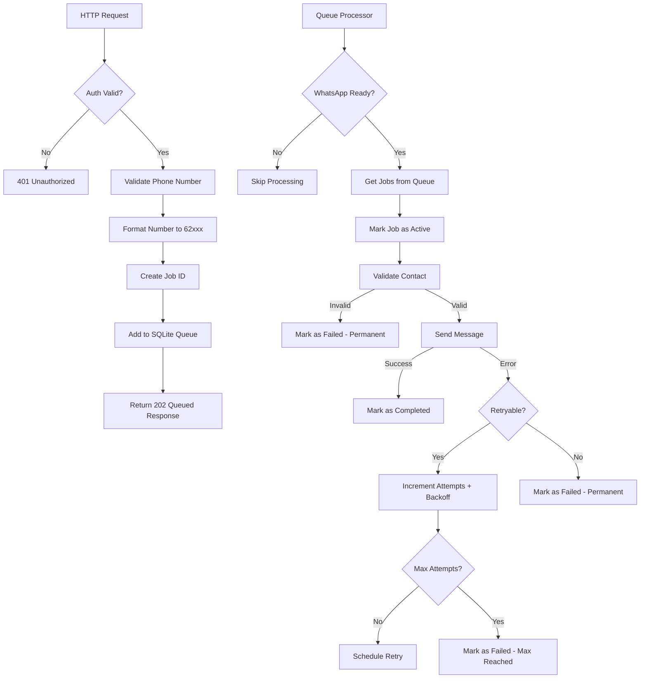
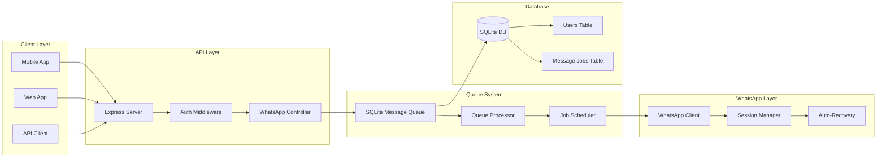
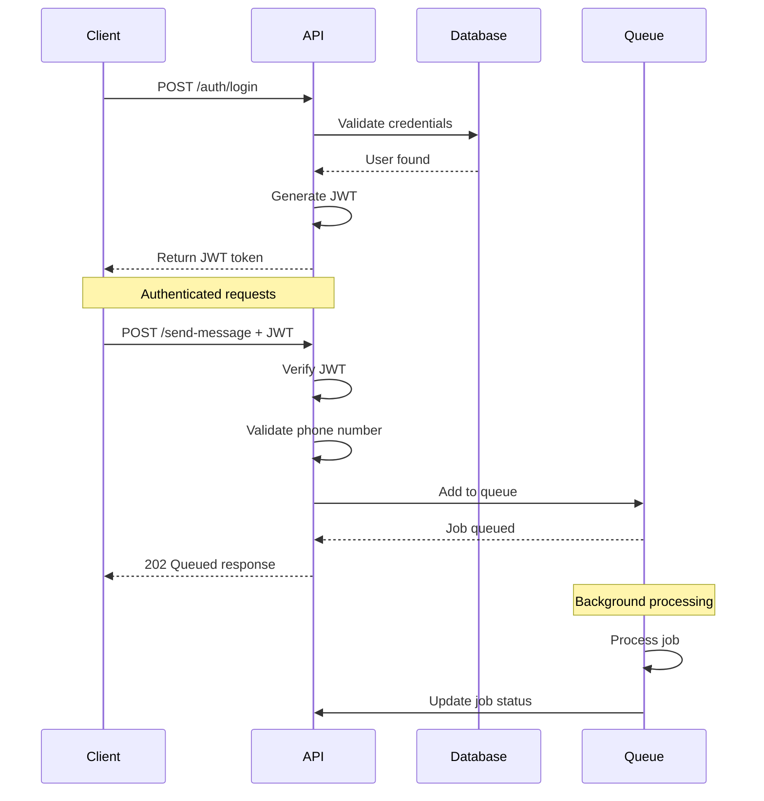
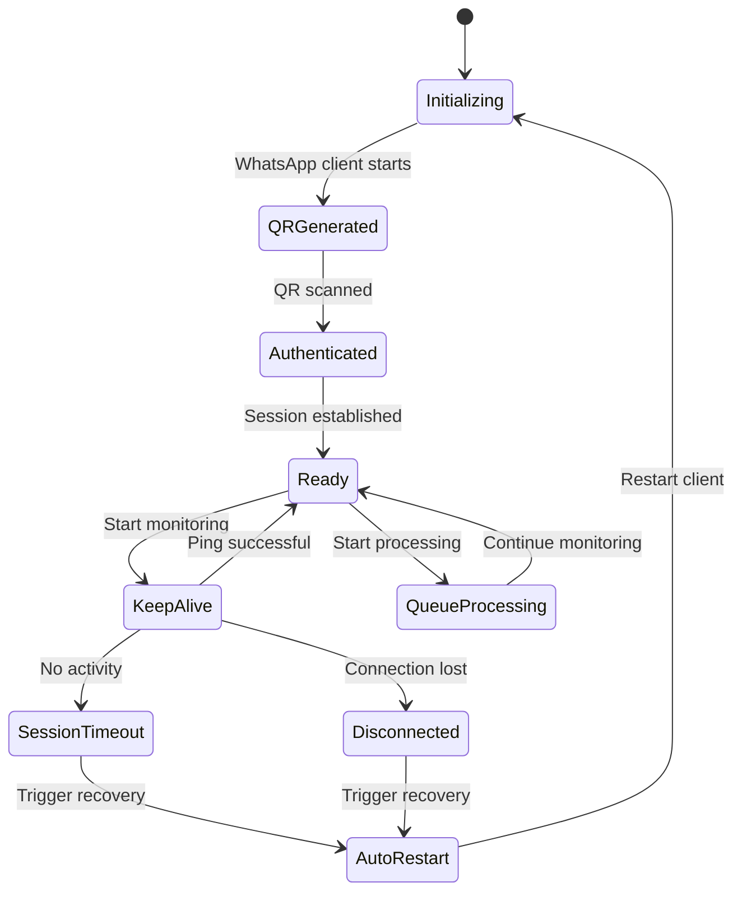
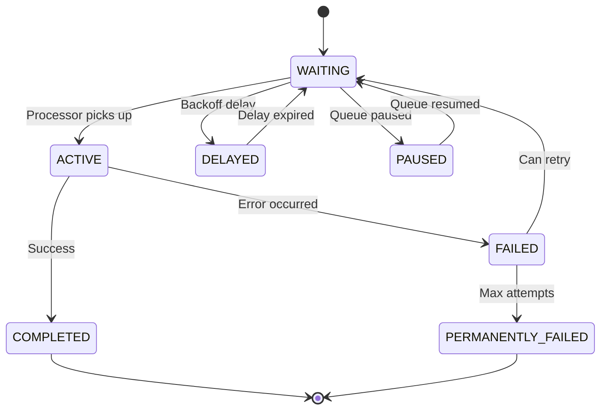
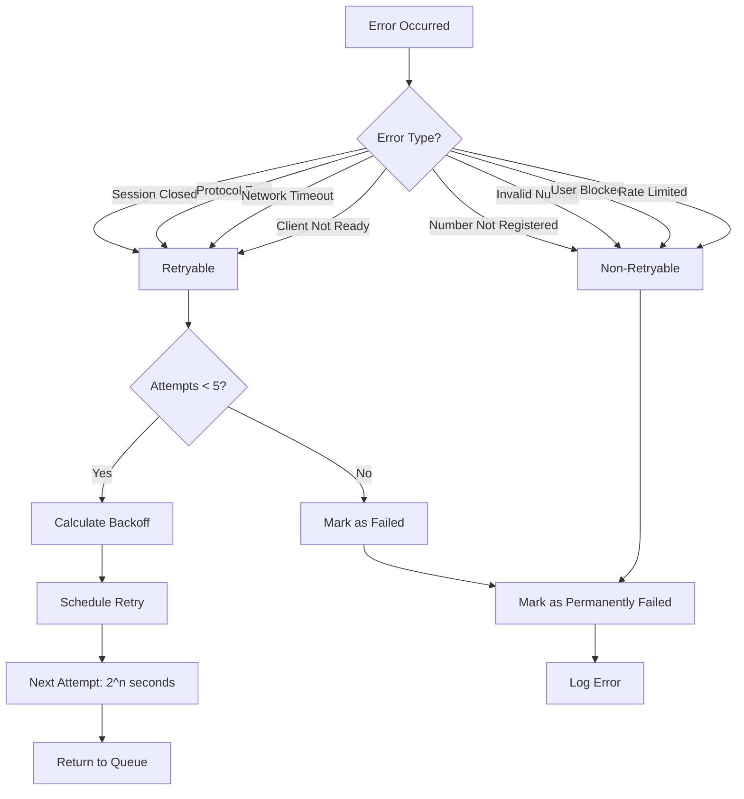

# WhatsApp API - Technical Flow Diagrams

## 🔄 Detailed Message Processing Flow

## 🏗️ System Component Architecture

## 🔐 Authentication & Security Flow

## ⚡ Auto-Recovery & Session Management

## 📊 Queue Job Lifecycle

## 🔧 Error Handling Decision Tree

